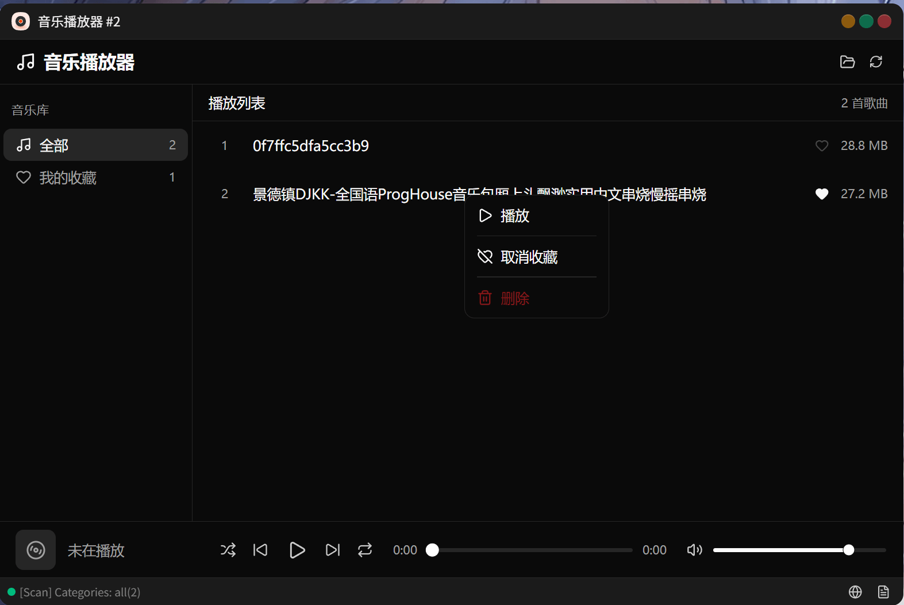
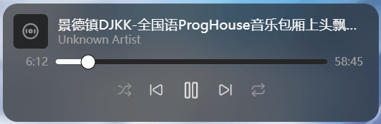

# 音乐播放器
> JSOS应用：https://jsos.dev

## 介绍
音乐播放器是一款用于播放本地音频文件的JSOS应用。支持自动扫描`$DATA_DIR`目录下的音乐文件，按文件夹自动分类管理，提供流畅的播放体验。

支持桌面挂件，可在JSOS桌面添加挂件快速播放收藏歌曲。

## 截图

## 功能特性
- **多格式支持**：MP3、WAV、OGG、FLAC、M4A、AAC、WMA、Opus
- **自动扫描**：每30秒自动扫描音乐目录，支持深度嵌套（最深10层）
- **智能分类**：按文件夹自动分类音乐文件
- **收藏管理**：支持收藏喜欢的歌曲，可通过挂件快速访问
- **元数据读取**：自动读取歌曲标题、艺术家、专辑等信息
- **桌面挂件**：3x1尺寸挂件，一键播放收藏歌曲

## 安装
下载release源码包，到 [JSOS.DEV](https://jsos.dev) 平台安装即可
